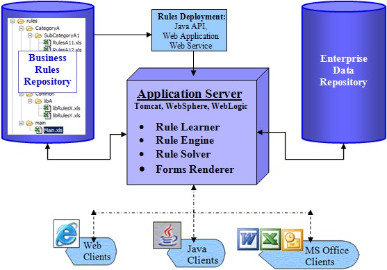

## URule
- URule 是一款纯 Java 规则引擎，它以 RETE 算法为基础，提供了向导式规则集、脚本式规则集、决策表、决策树、评分卡及决策流共六种类型的规则定义方式，配合基于 WEB 的设计器，可快速实现规则的定义、维护与发布。
- URule是一款纯Java规则引擎，它以RETE算法为基础，提供了向导式规则集、脚本式规则集、决策表、交叉决策表(PRO版提供)、决策树、评分卡及决策流共六种类型的规则定义方式，配合基于WEB的设计器，可快速实现规则的定义、维护与发布。
- URule 是第一款基于 Apache-2.0 协议开源的中式规则引擎。


+ 部分商业收费
+ 有管理后台，可以界面操作
+ 支持丰富的规则集
+ 集成方式：一种是嵌入式；一种是独立服务模式。


- http://www.bstek.com/resources/doc/ 简介 
- https://github.com/youseries/urule
- URule PRO版在线示例：http://112.124.15.63:8084/index.html  snow1986/123456

---

## Easy Rules

- Easy Rules 是开源的 Java 规则引擎。
- 轻量级框架和易于学习的API
- 基于POJO/注解
- 简单但功能强大
- 支持创建复合规则
- 可基于java代码和expression language(mvel)配置实现规则逻辑
  
```
示例 注解配置
@Rule(name = "weather rule", description = "if it rains then take an umbrella" )
public class WeatherRule {

    @Condition
    public boolean itRains(@Fact("rain") boolean rain) {
        return rain;
    }
    
    @Action
    public void takeAnUmbrella() {
        System.out.println("It rains, take an umbrella!");
    }
}
```


```
示例 rule.yml
name: "alcohol rule"
description: "children are not allowed to buy alcohol"
priority: 2
condition: "person.isAdult() == false"
actions:
  - "System.out.println(\"Shop: Sorry, you are not allowed to buy alcohol\");"
```

+ https://github.com/j-easy/easy-rules

---


## OpenRules
- OpenRules基于java完全开放源代码的商业规则管理框架。它有效的利用了MS Excel, Eclipse IDE 和其它java开源类库去构造，维护，部署，执行不同的复杂商业逻辑的规则引擎。
- OpenRules能做什么：
   - 有效的决策执行模型
   - 与Java或.NET简单集成
   - 基于规则的Web应用构建
   - 预测分析
   - 约束规划，优化
- 主要组件：
   - 规则库（Rule Repository）：有业务分析师使用Excel维护的企业级规则库
   - 管理引擎（Rule Engine）：通过内部相关的规则族执行决策模型
   - 规则学习器（Rule Learner）：规则发现，预测分析
   - 管理对话框（Rule Dialog）：开发动态规则为基础的Web问卷
   - 规则解析器（Rule Solver）：约束满足求解与问题优化
   - 有限状态机（Finite State Machines）：事件处理，连接点
   

   
+ https://www.oschina.net/p/openrules
+ https://openrules.com/

---

## Drools
- Drools 是用 Java 语言编写的开放源码规则引擎，使用 Rete 算法对所编写的规则求值。Drools 允许使用声明方式表达业务逻辑。可以使用非 XML 的本地语言编写规则，从而便于学习和理解。并且，还可以将 Java 代码直接嵌入到规则文件中，这令 Drools 的学习更加吸引人。
- Drools 还具有其他优点：
   - 非常活跃的社区支持
   - 易用
   - 快速的执行速度
   - 在 Java 开发人员中流行
   - 与 Java Rule Engine API（JSR 94）兼容
- 缺点   
   - 重量级
   - 业务分析师无法独立完成规则配置：由于规则主体DSL是编程语言（支持Java, Groovy, Python），因此仍然需要开发工程师维护。
   - 规则规模变大以后也会变得不好维护，相对硬编码的优势便不复存在。
   - 规则的语法仅适合扁平的规则，对于嵌套条件语义（then里嵌套when…then子句）的规则只能将条件进行笛卡尔积组合以后进行配置，不利于维护。
   


---
## QLExpress
- qlExpress本身只是一个脚本语言，可以被封装成规则引擎,qlexpress的语法很轻量，对原始的java代码有一定的兼容性问题，一般需要把数据的类型声明全部去掉，同时不支持异常处理,定制了很多特别的常用功能需求（宏定义，语法解析，公式计算，布尔逻辑处理，操作符函数的内置替换），可读性和功能更贴合业务需要，详细看qlExpress的扩展能力部分
- QLExpress 是一个轻量级的类java语法规则引擎，作为一个嵌入式规则引擎在业务系统中使用。让业务规则定义简便而不失灵活。让业务人员就可以定义业务规则。支持标准的JAVA语法，还可以支持自定义操作符号、操作符号重载、 函数定义、宏定义、数据延迟加载等。 

- 这个表达式相对别的计算工具，优点主要体现在：
   - A、不需要预先加载可能需要的所有属性值
   -  B、 用户可以根据业务需要自定义操作符号和函数 
   - C、可以同步输出判断错误信息，有利于提高业务系统在规则判断等使用场景下的用户体验。减少业务系统相关的处理代码。
     
- 主要用途：一些业务规则的组合判断，同时需要输出相关的错误信息

### 参考
- https://yq.aliyun.com/articles/621199
- https://github.com/alibaba/QLExpress
- https://yq.aliyun.com/articles/621200
- https://www.oschina.net/p/qlexpress
- https://yq.aliyun.com/album/130

---

## Esper
- Esper 可以让你进行快速的开发一个应用程序用来处理大量的消息和事件，它可以从不同的角度来过滤和分析事件并且在适当的条件下做出实时的响应。
- 复杂事件处理引擎
- 类似sql语法，容易学习
- 能够实现滑动窗口、不同数据流join、聚合等计算，学习成本不算很高。
- 简单的运行和开发环境，不需要引入Drools/drl堆栈，完全基于Java实现。


### 参考
- https://blog.csdn.net/luonanqin/article/details/21300263
- https://www.cnblogs.com/aking1988/p/3288215.html
- https://github.com/luonanqin/csdn-esper

---

## 参考
- https://www.oschina.net/project/tag/231/rule-engine
- https://tech.meituan.com/2017/06/09/maze-framework.html
